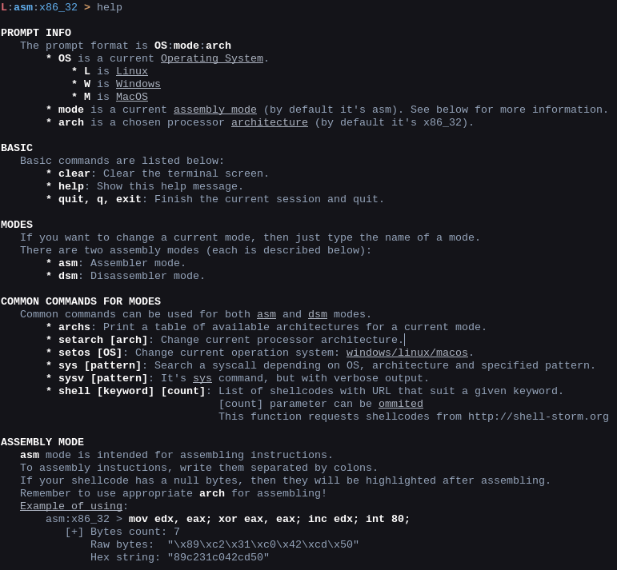
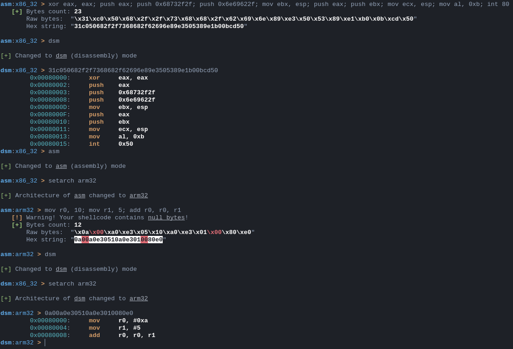
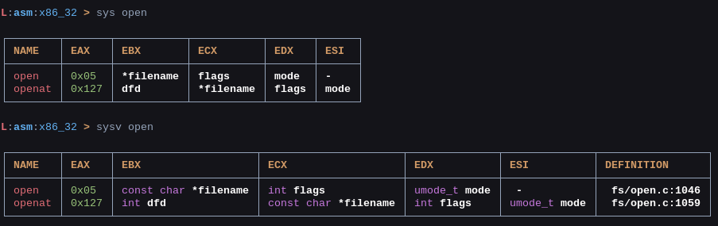
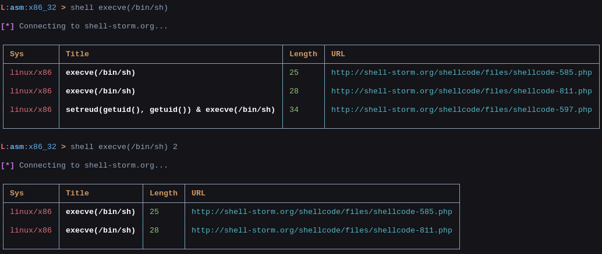
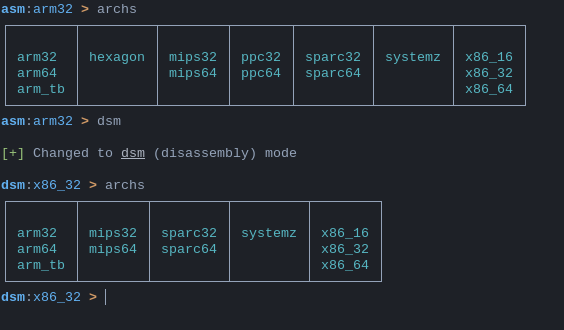

# Shellen

## General
Shellen is an interactive shellcoding environment. If you want a handy tool to write shellcodes, then shellen may be your friend. Also, it can be used just as assembly/disassembly tool.

It uses [keystone](https://github.com/keystone-engine/keystone) and [capstone](https://github.com/aquynh/capstone) engines for all provided operations.

Shellen **works only on python3**. Maybe it will be changed in the future.

## Installing
You can install the stable version of shellen using pip3:
```sh
$ sudo pip3 install shellen
```

Or if you already have all required packages (see [Requirements](#requirements)):
```sh
$ python3 setup.py install
```

If you have any trouble with installing keystone-engine, then you should compile it by yourself (see the [COMPILE.md](https://github.com/keystone-engine/keystone/blob/master/docs/COMPILE.md) file in the [keystone](https://github.com/keystone-engine/keystone) repository)

## How to run:
After installing shellen and all its required packages, you can run shellen just by typing the next in your terminal:
```sh
$ shellen
```
There is the ```help``` command inside the tool, that will explain almost everything.

## Features
Shellen was created for assembling and disassembling instructions, so there are two modes of using the tool: **asm** and **dsm** respectively. Of course, there are some other possibilities like syscalls tables, common shellcodes and other.

## Problems/New features
If you find a problem/bug or something, then just write an issue about this problem. Also, if you think, that some feature will be nice to use in shellen, then do the same -- write an issue and I will try to add this feature.

### Prompt
It also has a usefull prompt, displaying current mode, OS (Operating System for syscalls) and chosen architecture exactly for this mode. It looks as follows:
```sh
L:asm:x86_32 >
```
You can edit your input like you're typing in a terminal. Also, it has a history of commands (just type up arrow to see them).

```L``` is the shortened name of ```Linux``` in the prompt. Below listed all other OS names:
- ```L``` is Linux
- ```W``` is Windows
- ```M``` is MacOS

If you want to change OS, then type ```setos [linux/windows/macos]``` as follows:
```sh
L:asm:x86_32 > setos windows

[+] OS changed to windows.
```


To change current mode, enter ```asm``` or ```dsm``` in the prompt.
```sh
L:dsm:arm32 > asm

[+] Changed to asm (assembly) mode

L:asm:x86_32 > dsm

[+] Changed to dsm (disassembly) mode

L:dsm:arm32 > 
```

### Assembling
To assembly instuctions, type them separated by colons as follows:
```sh
L:asm:x86_32 > mov edx, eax; xor eax, eax; inc edx; int 80;
   [+] Bytes count: 7
       Raw bytes:  "\x89\xc2\x31\xc0\x42\xcd\x50"
       Hex string: "89c231c042cd50"
```
If your assembled bytes contain a null byte, then shellen will tell you about this.

### Disassembling
It works exactly as assembling. Type your bytes in the input prompt and see the result!
```sh
L:dsm:x86_32 > 89c231c042cd50
        0x00080000:     mov     edx, eax
        0x00080002:     xor     eax, eax
        0x00080004:     inc     edx
        0x00080005:     int     0x50
```

### Architectures
```asm``` and ```dsm``` modes work for different architectures. To see a list of available architectures for a current mode, type this:
```sh
L:dsm:x86_32 > archs
┌────────┬────────┬─────────┬─────────┬────────┐
│        │        │         │         │        │
│ arm32  │ mips32 │ sparc32 │ systemz │ x86_16 │
│ arm64  │ mips64 │ sparc64 │         │ x86_32 │
│ arm_tb │        │         │         │ x86_64 │
└────────┴────────┴─────────┴─────────┴────────┘
```

And if you want to change current architecture, enter follow:
```sh
L:dsm:x86_32 > setarch arm32

[+] Architecture of dsm changed to arm32
```

### Syscalls
It's apparent that in process of crafting a shellcode you will be needed syscalls. So, shellen will help you with that. Just type ```sys``` with a name of desired syscall and shellen will show you a list of possible syscalls you were looking for.
```sh
L:asm:x86_32 > sys open

┌────────┬───────┬──────────────────────┬──────────────────────┬──────────────┬──────────────┐
│ name   │ eax   │ ebx                  │ ecx                  │ edx          │ esi          │
├────────┼───────┼──────────────────────┼──────────────────────┼──────────────┼──────────────┤
│ open   │ 0x05  │ const char *filename │ int flags            │ umode_t mode │ -            │
│ openat │ 0x127 │ int dfd              │ const char *filename │ int flags    │ umode_t mode │
└────────┴───────┴──────────────────────┴──────────────────────┴──────────────┴──────────────┘
```
This prints possible variants of syscall depending on entered pattern. Syscall table for searching depends on chosen architecture and OS (Operating System). In this case it's ```x86_32``` and ```Linux```.


### Common shellcodes
Shellen can show you a list of common shellcodes depending on your keyword. The example of using placed in ```Pictures``` section. It uses API of shell-storm.org site (thanks to the author!). You can use it like this:
```sh
L:asm:x86_32 > shell <keyword> <count>
```
Actually, ```count``` parameter isn't required.

### Operating Systems
It was assumed that there will be several OSs (Linux, Windows and MacOS), but right now supported only Linux. If you want to add functionality for Windows or MacOS, then write an issue and I will add it.

### Base commands
Command | Description
------- | -----------
```clear``` | Clear the terminal screen. As usual ```cls``` on Windows or ```clear``` on *nix systems.
```help``` | Show the help message.
```quit,q,exit``` | Finish the current session and quit


## Requirements
- [keystone](https://github.com/keystone-engine/keystone)
- [capstone](https://github.com/aquynh/capstone)
- [colorama](https://github.com/tartley/colorama)
- [termcolor](https://pypi.python.org/pypi/termcolor)
- [terminaltables](https://github.com/Robpol86/terminaltables)

## TODO
- [x] Assembling
- [x] Disassembling
- [x] Syscalls lists
- [x] Database of common shellcodes

## Pictures
Just a little bunch of pictures. (They are outdated because of adding different features)

<p align="left">
  
</p>

<p align="left">
  
</p>

<p align="left">
  
</p>

<p align="left">
  
</p>

<p align="left">
  
</p>

